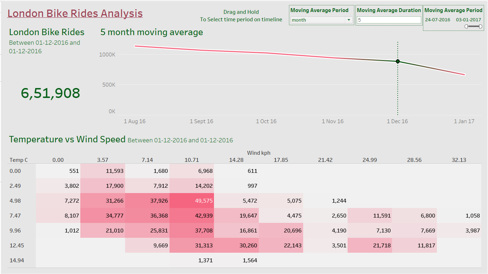

# London Bike Rides Analysis Dashboard

## Introduction
In this project, we leverage Tableau for data visualisation to gain insights into bike sharing patterns in London. By analysing various factors such as weather conditions, time of day, and bike usage trends, we aim to uncover meaningful insights that can inform decision-making processes.
## Overview
This project aims to analyze data from London's bike-sharing system to uncover trends and patterns in bike rides. The process involves programmatically gathering the necessary data, followed by a thorough exploration, assessment, and manipulation using Python and the pandas library. The final phase involves creating impactful visualizations in Tableau to effectively communicate the findings. These visualizations provide insights into various aspects of bike-sharing usage, such as peak usage times, popular routes, and demographic patterns of riders.
## Project Structure
This project analyzes London bike-sharing data to identify trends and patterns in bike rides. The analysis involves three main steps:

1. Programmatically gathering data.

2. Exploring, assessing, and manipulating the data using Python and the pandas library.

3. Creating impactful visualizations in Tableau.

## Resource & Technologies Used

**Dataset**

Option 1: [Kaggle](https://www.kaggle.com/datasets?fileType=csv)

Option 2: And, also the dataset can be found on [Mo chen](https://www.youtube.com/@mo-chen) YouTube Channel. I am grateful for his guidance on this project.

**Tools** 

Programming Language: Python

Microsoft Excel,Jupiter Notebook, and Tableau.

## Data Analysis & Visualization 
### 1. Loading dataset in Jupiter Notebook using Python pandas library. 

**Insight:** Exploring loaded data.

### 2. Cleaning and meticulously prepared it for analysis. 

**Insight:** Final Check on Cleaned Data.

### 3. Creating line chart for moving average along with parameters.

**Insight:** With the help of parameters and reference band we can see the total bike rides count and trends of rider counts.

### 4. Creating Heat Map Table for temperature vs windspeed.

**Insight:** Based on temperature and windspeed we can clearly see the count of the riders.

### 5. Creating a bar chart to find the count of the riders based on weather.

**Insight:** We can see that clear and scattered cloud weather's have highest rider's count compare to other weathers. 

### 6. Creating a bar chart to find the count of the riders based on hour.

**Insight:** The highest rider count is 1,10,063.

### 7. Finding the total riders count using reference band or range.

**Insight:** When you select the particular range it line chart based on the selected reference band range. It gives us Total Bike Rides.

### 8. Interactive Dashboard

**Insight:** The dashboard provides insights into the relationship between weather conditions, time of day, and the number of bike rides. Users can explore how different factors, such as weather and time, affect ride counts. The dashboard also highlights peak ride periods and the impact of various conditions on bike usage.

## Conclusion
The analysis successfully revealed significant trends and patterns in London’s bike-sharing data. Key findings included the identification of peak usage periods, commonly used routes, and demographic factors influencing bike usage. The Tableau visualizations provided a clear and accessible way to understand these insights, offering valuable information for city planners and bike-sharing program managers. The project demonstrated the potential of data analysis and visualization tools in extracting actionable insights from raw data.
## Recommendations
**Optimizing Bike Availability:** The analysis suggests the need for a strategic redistribution of bikes during peak hours and in high-demand areas. Implementing real-time tracking and dynamic redistribution can improve service efficiency.

**Expanding Infrastructure:** Data indicates certain areas with high demand but limited infrastructure. Expanding docking stations and bike lanes in these areas could accommodate more riders and enhance safety.

**Targeted Marketing Campaigns:** The demographic analysis suggests potential for targeted marketing campaigns to increase ridership among underrepresented groups, encouraging a broader demographic to use the service.
## Reflection
This project highlighted the importance of data-driven decision-making in managing urban transportation systems. The combination of Python for data manipulation and Tableau for visualization proved effective in transforming raw data into meaningful insights. The process underscored the value of thorough data cleaning and preparation, which are crucial steps in ensuring the accuracy and relevance of the analysis. Moving forward, integrating real-time data analysis could provide even more dynamic and actionable insights, helping to continuously improve the efficiency and accessibility of the bike-sharing system in London.

